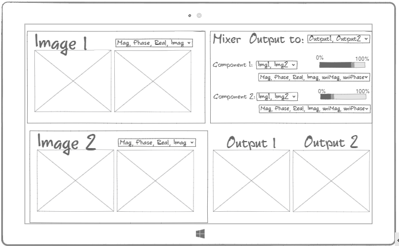

> # Lecture 1 Notes
  \- Software companies generally are divided into many types:
-  A software company that is based on a specific product, sells this product as a service like: Facebook, Twitter, Microsoft, etc.
- A software company that is a software house for developing whatever the client needs on request. It doesnt develop software by itself. As an example the client requests a website, a mobile application or a piece of software in general and the company delivers what the client needs.

\- The development methodology in both types may differs but its mainly the same.

\- Lets observe the development phases of a software house. for example Seoudi market requests a website from a software house. what would you do first?

\- typically, something like this:

  

1. **Requirements Gathering** or **Requirments specification**: 
   
    - Gather the req. from the client. There are two types of req.:
      - **Functional requirements**: the application flow in general like: the user can login, search for products, notification about new offers, has a shopping cart, has payment gateway (can buy things) etc..
      - **Non-Functional requirements**: response time of the website(speed), security, reliability(doesnt crash), scalablitiy(can grow big), responsive UI, etc..
  
2. **Requirements Analysis**: 
   - Understand what's the nature of the client's business. the analysis is mainly business analysis.
   - After this step, Both the customer and the software developer work together so as to document all the functions, performance, and interfacing requirement of the software. **It describes the "what" of the system to be produced and not "how"**. In this phase, a large document called **Software Requirement Specification (SRS)** document is created which contained a detailed description of what the system will do in the common language.

3. **Mockups Design**:
   - Translate the requirements into mockups that the client can visualize. means showing off how your design look like
   - pretty sure you know this UI Mockup :)

  

4. **Design The Software Architecture**: 
   - This phase aims to transform the requirements gathered in the SRS into a suitable form which permits further coding in a programming language. It defines the overall software architecture together with high level and detailed design. All this work is documented as a **Software Design Document (SDD)**.
   - **C4 model** is created also to visualize the architecture of a software system in 4 hierarchical levels:

      - Context diagrams (level 1): show the system in scope and its relationship with users and other systems.

      - Container diagrams (level 2): decompose a system into interrelated containers. A container represents an application or a data store.

      - Component diagrams (level 3): decompose containers into interrelated components, and relate the components to other containers or other systems.

      - Code diagrams (level 4): provide additional details about the design of the architectural elements that can be mapped to code.
      - [The C4 model for visualising software architecture](https://c4model.com/)

5. **Implementation & Development**: 
   - This process is devided into tasks & milestones.
   - These tasks are put on a task tracking system like: Jira. 
   - The developer will be assigned a task then he will make a branch for that task(feature), write the code and its unit tests and commit it on that branch.
   - The developer will make a pull request for someone to review his  code.
   - If the code is accepted by the reviewer, it will be merged to the main branch. 

6. **Testing**: 
    - Unit testing: is a way of testing a unit -the smallest piece of code- that can be logically isolated in a system. A unit can be a function, a subroutine, a method or property. If this unit needs any other system component connected to it -for example a database- to operate  we then need to use a mock DB so we dont crash our main DB if there is an error in this unit. Also Read about TDD (Test Driven Development).
    - Integration testing: is the phase in software testing in which individual software modules are combined and tested as a group.
    - System testing: is testing conducted on a complete integrated system to evaluate the system's compliance with its specified requirements. System testing takes, as its input, all of the integrated components that have passed integration testing. 

  
7. **CI/CD pipeline** (continuous integration/continuous delivery):

   - As a reviewer how do I run the code and test it? should I download the code and the tests everytime and run it manually? what about automating this process? Here comes the importance of the CI/CD pipeline.  

   - The CI pipeline: can have many automated checks: test coverage, static code analysis, check style etc..

    - The CD pipline: deployment of the reviewed feature on a test server for manual testing then on the production server.

8. **Manual Testing**: 
   - There is some functionalities that need to be tested manually or need someone to develop automated test for it. Testers design test cases from the SRS document and the use cases. the test cases give feedback on the SRS document to modify/add requirements.
  
9.  **User Acceptance Testing**: 
    - A type of testing performed by the end user or the client to verify/accept the software system before moving the software application to the production environment.

10. **Release**: 
    - The product functionality is released.

\- What if we reached the user acceptance testing and the user said: That's not what I want! (aaaaaaaaah)

## **Development Methodologies**:
  - Some systems needs to be well defined from the start like an MRI system for example, so we apply the waterfall methodology. Other software products need to have quick releases along with high flexiblitiy in the requirements with no problem to adapt to changes fast enough to grap the market attention and acquire it, those software can't apply waterfall methodology and needs the agile methodology instead.

1. **Waterfall Methodology**:
is a sequential software development process, where progress flows steadily toward the conclusion (like a waterfall) through the phases of a project (that is, analysis, design, development, testing). This involves fully documenting a project or an MVP (minimal viable product) in advance, including the user interface, user stories, and all the features’ variations and outcomes.

    [Learn More..](https://learn.marsdd.com/article/product-development-the-waterfall-methodology-model-in-software-development/)

  

2. **Agile Methodology**:
is an iterative approach to product development that is performed in a collaborative environment by self-organizing teams. The methodology produces high-quality software in a cost-effective and timely manner to meet stakeholders’ changing needs.

  

  
simply speaking, you begin with small requirments, feed them through an entire software development cycle then launch quickly, then get another subset of the requirments, feed them to the software development cycle then launch, feed another subset of requirments and launch, and so on. this process can be parallel, each team works on a subset of the requirments etc..

[Learn More..](https://learn.marsdd.com/article/product-development-using-agile-methodology-for-software-development/)

